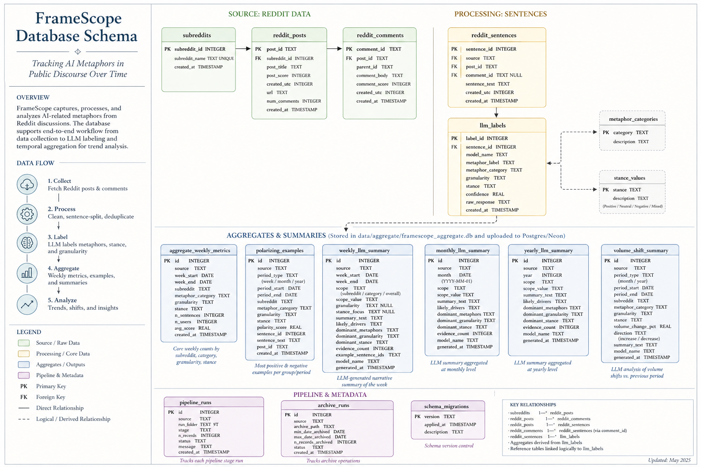

============================================================
Overview
============================================================

FrameScope is a data-centric NLP pipeline for tracking AI discourse on Reddit using sentence-level annotation and temporal aggregation.

Core pipeline:

reddit_posts
    ↓
reddit_sentence_items
    ↓
llm_labels
    ↓
aggregate_weekly_metrics / summaries

============================================================
1. reddit_posts
============================================================

Stores raw Reddit posts and comments.

Columns:
- source (TEXT)
- post_id (TEXT)
- item_type (TEXT): post/comment
- subreddit (TEXT)
- author (TEXT)
- created_utc (INTEGER)
- created_datetime (TEXT)
- title (TEXT)
- selftext (TEXT)
- text (TEXT)
- score (INTEGER)
- num_comments (INTEGER)
- url (TEXT)
- link_id (TEXT)
- parent_id (TEXT)
- raw_file (TEXT)
- run_folder (TEXT)
- inserted_at (TIMESTAMP)

Primary Key:
(source, post_id)

============================================================
2. reddit_sentence_items
============================================================

Stores AI-related sentence-level units.

Columns:
- source (TEXT)
- sentence_id (TEXT)
- post_id (TEXT)
- item_type (TEXT)
- subreddit (TEXT)
- author (TEXT)
- created_utc (INTEGER)
- created_datetime (TEXT)
- sentence_index (INTEGER)
- preceding_sentence (TEXT)
- ai_sentence (TEXT)
- subsequent_sentence (TEXT)
- context_text (TEXT)
- full_text (TEXT)
- score (INTEGER)
- num_comments (INTEGER)
- url (TEXT)
- link_id (TEXT)
- parent_id (TEXT)
- raw_file (TEXT)
- run_folder (TEXT)
- inserted_at (TIMESTAMP)

Primary Key:
(source, sentence_id)

Foreign Key:
(source, post_id) → reddit_posts(source, post_id)

============================================================
3. llm_labels
============================================================

Stores LLM-generated annotations.

Columns:
- source (TEXT)
- sentence_id (TEXT)
- metaphor_category (TEXT)
- metaphor_present (INTEGER)
- granularity (TEXT)
- stance (TEXT)
- confidence (REAL)
- reasoning (TEXT)
- model_name (TEXT)
- labeled_at (TIMESTAMP)

Primary Key:
(source, sentence_id)

Foreign Key:
(source, sentence_id) → reddit_sentence_items(source, sentence_id)

============================================================
4. aggregate_weekly_metrics
============================================================

Weekly aggregated statistics.

Columns:
- id (INTEGER)
- source (TEXT)
- week_start (TEXT)
- week_end (TEXT)
- subreddit (TEXT)
- item_type (TEXT)
- metaphor_category (TEXT)
- granularity (TEXT)
- stance (TEXT)
- n_sentences (INTEGER)
- n_items (INTEGER)
- avg_score (REAL)
- created_at (TIMESTAMP)

============================================================
5. polarizing_examples
============================================================

High-salience examples for interpretation.

Columns:
- id (INTEGER)
- source (TEXT)
- period_type (TEXT)
- period_start (TEXT)
- period_end (TEXT)
- scope (TEXT)
- scope_value (TEXT)
- subreddit (TEXT)
- item_type (TEXT)
- metaphor_category (TEXT)
- granularity (TEXT)
- stance (TEXT)
- sentence_id (TEXT)
- post_id (TEXT)
- context_text (TEXT)
- ai_sentence (TEXT)
- score (INTEGER)
- rank (INTEGER)

============================================================
6. weekly_llm_summary
============================================================

LLM-generated summaries.

Columns:
- id (INTEGER)
- source (TEXT)
- week_start (TEXT)
- week_end (TEXT)
- scope (TEXT)
- scope_value (TEXT)
- granularity (TEXT)
- stance_focus (TEXT)
- summary_text (TEXT)
- likely_drivers (TEXT)
- dominant_metaphors (TEXT)
- dominant_granularity (TEXT)
- dominant_stance (TEXT)
- evidence_count (INTEGER)
- example_sentence_ids (TEXT)
- model_name (TEXT)
- generated_at (TIMESTAMP)

============================================================
7. pipeline_runs
============================================================

Tracks pipeline execution.

Columns:
- id (INTEGER)
- source (TEXT)
- run_folder (TEXT)
- stage (TEXT)
- n_records (INTEGER)
- status (TEXT)
- message (TEXT)
- created_at (TIMESTAMP)

============================================================
Relationships
============================================================

reddit_posts (1) → (many) reddit_sentence_items  
reddit_sentence_items (1) → (1) llm_labels  

llm_labels → aggregate_weekly_metrics  
aggregate_weekly_metrics → weekly_llm_summary  
aggregate_weekly_metrics → polarizing_examples  

============================================================
Example Query
============================================================

SELECT
    r.subreddit,
    r.created_utc,
    r.ai_sentence,
    l.metaphor_category,
    l.granularity,
    l.stance
FROM reddit_sentence_items r
JOIN llm_labels l
    ON r.source = l.source
   AND r.sentence_id = l.sentence_id
WHERE r.source = 'reddit';

============================================================
Notes
============================================================

- Sentence is the atomic unit of analysis
- Pipeline is idempotent
- LLM labeling is incremental
- Supports longitudinal discourse analysis
