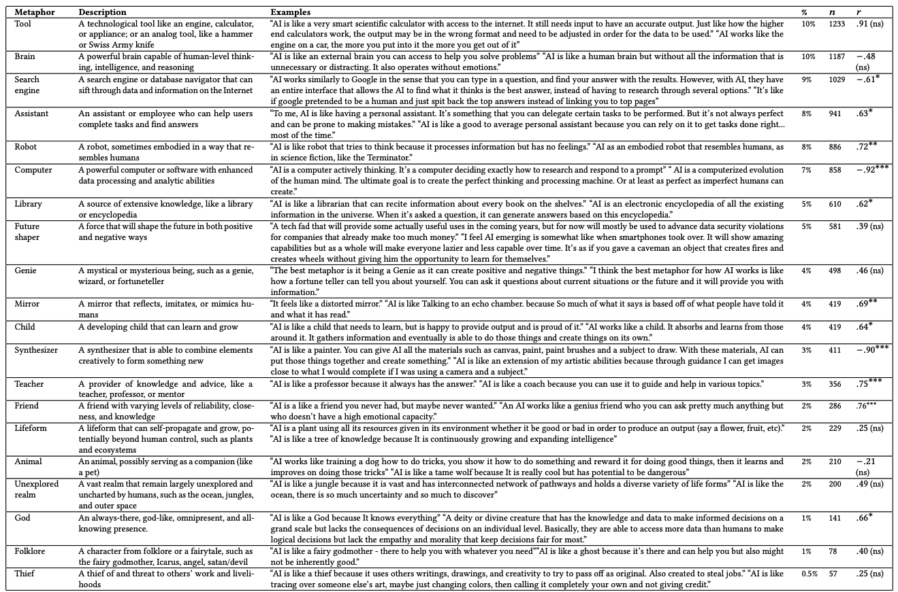
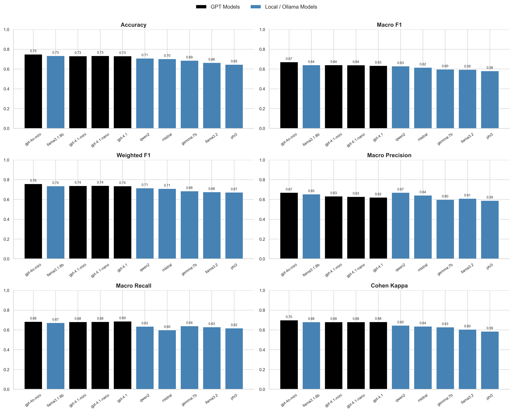
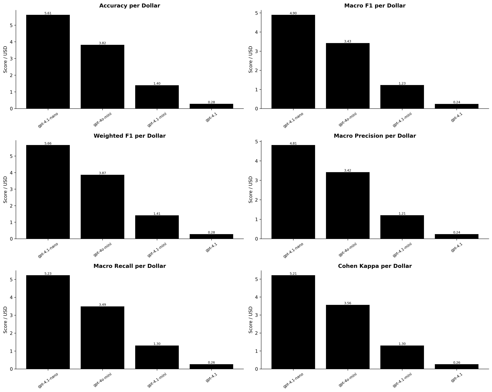
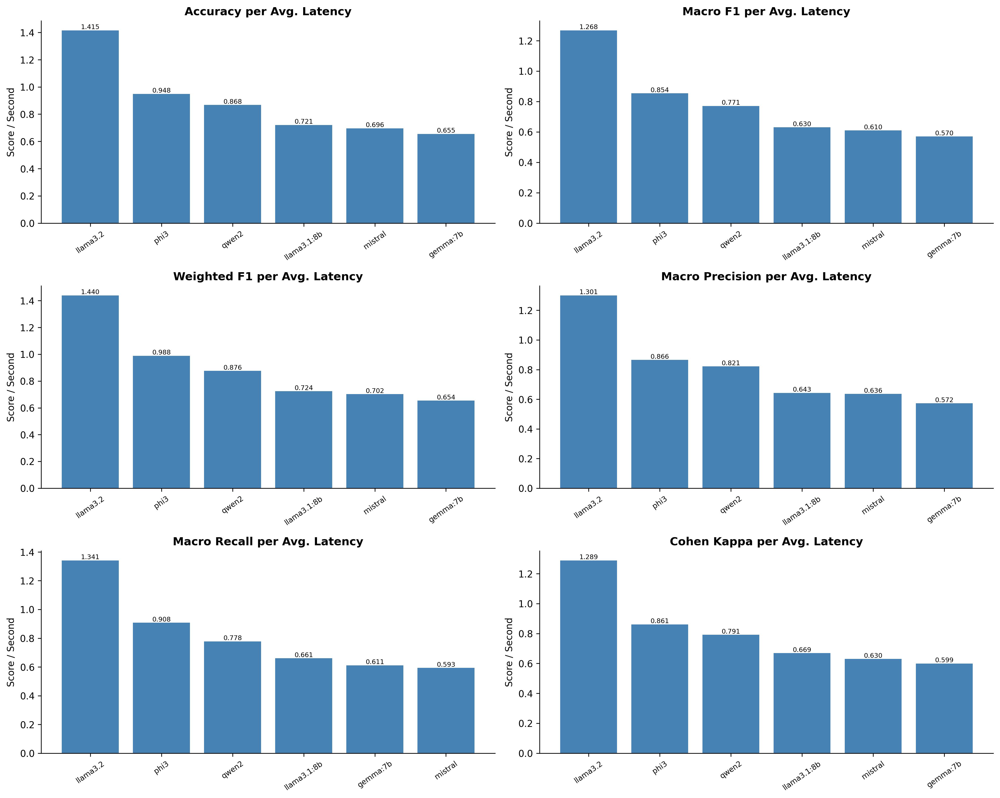
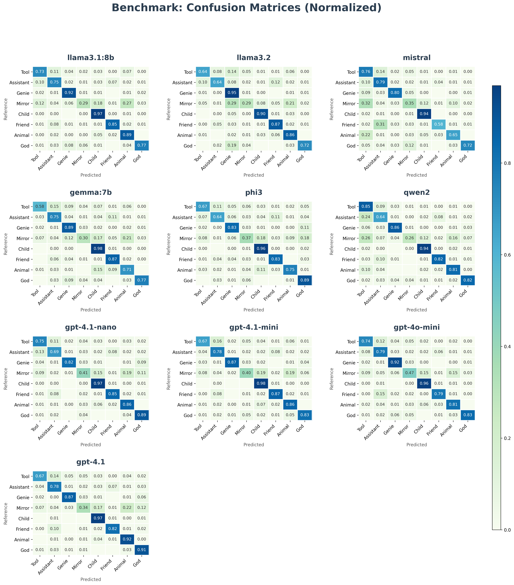
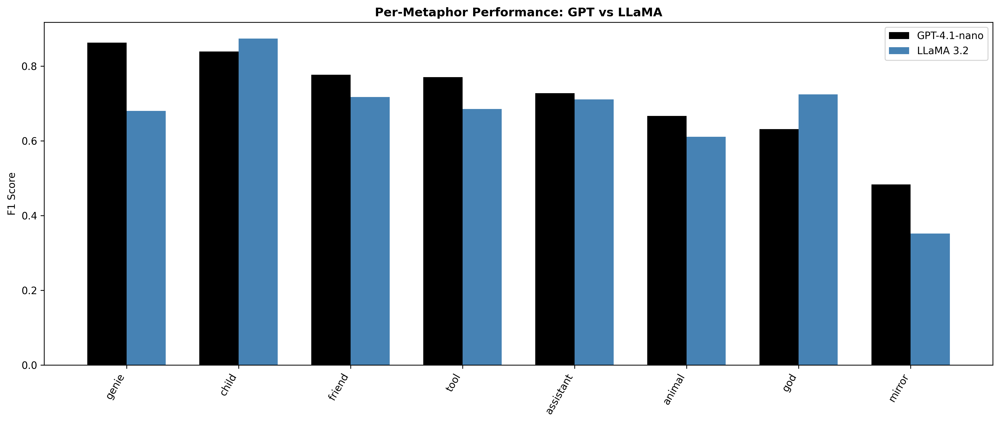
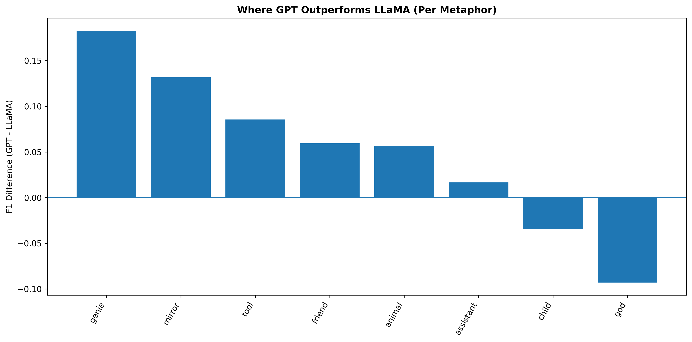
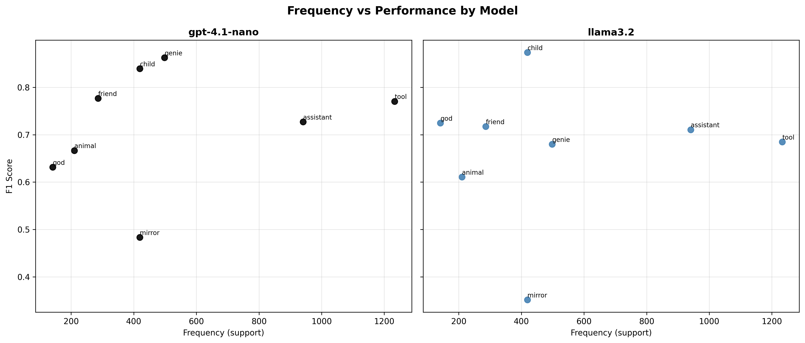

# Model Selection for Metaphor Classification Pipeline

## 1. Introduction

This document presents the model selection process for the metaphor classification pipeline used in the FrameScope project. The goal is to identify a model that provides an optimal trade-off between performance, cost, and latency for **weekly large-scale inference**.

We evaluate both:
- **API-based models (GPT family)**  
- **Local models (Ollama-based LLaMA and others)**  

The final selection is driven not only by predictive performance but also by **operational constraints**, particularly recurring cost and scalability.

All experiments and results are derived from the notebook:

> [Notebooks/01_LLM_comparison_metrics.ipynb](../Notebooks/01_LLM_comparison_metrics.ipynb)

---

## 2. Methodology: Metaphor Selection

To ensure a fair and reproducible benchmark, we did not evaluate all metaphor classes from all sources. Instead, we used a controlled label selection strategy based on overlap between:

- the metaphor taxonomy reported in "From Tools to Thieves” (Cheng et al.)
- the FrameScope metaphor schema used in this project

### 2.1 Source Taxonomies

- **Myra/Cheng taxonomy:** the full set of metaphor categories from the reference paper
- **FrameScope taxonomy:** the operational categories available in our labeling schema

### 2.2 Selection Rule (Strict Intersection)

We used only categories that appear in **both** taxonomies with direct semantic equivalence.

- No manual remapping across non-equivalent labels
- No inferred merges or subjective category translation

This prevents introducing interpretation bias during evaluation.

### 2.3 Final Evaluation Labels

The final shared label set used for model evaluation was:

- Tool
- Assistant
- Genie
- Mirror
- Child
- Friend
- Animal
- God

### 2.4 Why This Matters

- Keeps comparison aligned with both the paper benchmark and the FrameScope production schema
- Avoids label leakage from subjective mapping decisions
- Improves reproducibility of results across model runs

---

## 3. Experimental Setup

### 3.1 Task

The task is **single-label metaphor classification**, where each input text is assigned a **dominant metaphor category**.

### 3.2 Models Evaluated

#### GPT Models (API-based)
- gpt-4.1-nano  
- gpt-4.1-mini  
- gpt-4o-mini  
- gpt-4.1  

#### Local Models (Ollama)
- llama3.1:8b  
- llama3.2  
- mistral  
- qwen2  
- gemma:7b  
- phi3  

---

### 3.3 Evaluation Metrics

We evaluate models using:

- Accuracy  
- Macro F1 (primary metric)  
- Weighted F1  
- Macro Precision  
- Macro Recall  
- Cohen’s Kappa  

---

## 4. Overall Model Performance

### Observations

- **gpt-4o-mini** achieves the best overall performance  
- **gpt-4.1-nano** performs nearly as well despite significantly lower cost  
- Among local models, **llama3.1:8b** and **llama3.2** are the strongest  

### Key Insight

Performance differences across models are relatively small (~0.03–0.04 Macro F1), suggesting that **efficiency considerations are critical**.

---

## 5. Cost–Performance Trade-off (GPT Models)

### Observations

- **gpt-4.1-nano** provides the highest performance per dollar  
- **gpt-4o-mini** offers the best raw performance  
- **gpt-4.1** is significantly more expensive with minimal performance gain  

### Interpretation

Higher-cost models do not yield proportional performance improvements.  
This makes **gpt-4.1-nano the most cost-efficient GPT model**.

---

## 6. Latency–Performance Trade-off (Local Models)

### Observations

- **llama3.2** achieves the best performance per second  
- **phi3** and **qwen2** are competitive but slightly weaker  
- Larger models (e.g., llama3.1:8b) are slower without clear performance gains  

### Interpretation

Latency becomes a critical factor for large-scale inference.  
**llama3.2 provides the best balance between speed and performance.**

---

## 7. Confusion Matrix Analysis

### Observations

- Strong performance on:
  - genie  
  - child  
  - animal  
  - god  

- Consistent confusion between:
  - tool ↔ assistant  
  - mirror ↔ tool  

### Interpretation

Errors are **systematic**, not random.  
They arise from **semantic overlap between metaphor categories**, rather than model limitations.

---

## 8. Per-Metaphor Comparison (Selected Models)

We compare the best-performing models from each category:

- **GPT (cost-efficient): gpt-4.1-nano**  
- **Local (latency-efficient): llama3.2**

---

### 8.1 Per-Metaphor Performance

### Observations

- GPT outperforms on:
  - genie  
  - mirror  
  - tool  
  - friend  

- LLaMA outperforms on:
  - child  
  - god  

### Interpretation

- GPT excels at **abstract and interpretive metaphors**  
- LLaMA performs well on **intuitive, human-centered metaphors**

---

### 8.2 Performance Differences

### Observations

- Largest GPT gains:
  - genie  
  - mirror  
- Near parity:
  - assistant  
  - animal  

### Interpretation

Differences are driven by **semantic complexity**, not model size.

---

### 8.3 Frequency vs Performance

### Observations

- High-frequency categories are not always best-performing  
- Some lower-frequency categories achieve higher F1 scores  

### Interpretation

Performance depends more on **semantic clarity** than data frequency.

---

## 9. Final Model Selection

### Selected Model: **llama3.2**

### Justification

1. **Zero cost for recurring inference**
   - Weekly pipeline execution requires sustainable scaling  
   - API costs would accumulate significantly over time  

2. **Strong performance**
   - Competitive Macro F1 compared to GPT models  
   - Only marginally lower than top-performing models  

3. **Best latency-performance trade-off**
   - Fastest inference among local models  
   - Suitable for large-scale batch processing  

4. **Operational independence**
   - No reliance on external APIs  
   - Full control over deployment and updates  

---

## 10. Conclusion

This evaluation demonstrates that:

- Model selection should consider **cost, latency, and deployment constraints**, not just accuracy  
- Smaller, efficient models can provide **near-parity performance**  
- Errors are primarily driven by **semantic ambiguity in the task**

### Final Decision

> While GPT models offer slightly higher performance,  
> **llama3.2 is selected due to its zero cost, strong efficiency, and scalability for weekly inference.**

---

## 11. Reference

- Notebook: [Notebooks/01_LLM_comparison_metrics.ipynb](../Notebooks/01_LLM_comparison_metrics.ipynb)  
- Plots: [plots/model_benchmark](../plots/model_benchmark/)  